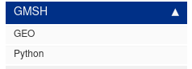

When modifying these docs, its useful to run the website locally.

## Installation instructions

You will need to install Jekyll.

### Mac instructions

If you do not have Rubygems installed, you will need to do that first.
Using brew ([see install instructions here](https://brew.sh/)) run,

```bash
brew install ruby
```

You may need to update your path once installed. The instructions for this should pop up at the end of the installation. For example,

```bash
Removing: /Users/torres/Library/Logs/Homebrew/unbound... (64B)
Pruned 0 symbolic links and 10 directories from /opt/homebrew
==> Caveats
==> ruby
By default, binaries installed by gem will be placed into:
 /opt/homebrew/lib/ruby/gems/3.3.0/bin
You may want to add this to your PATH.
ruby is keg-only, which means it was not symlinked into /opt/homebrew,
because macOS already provides this software and installing another version in
parallel can cause all kinds of trouble.
If you need to have ruby first in your PATH, run:
 echo ‘export PATH=“/opt/homebrew/opt/ruby/bin:$PATH”’ >> ~/.zshrc
```

Once you follow these instructions, open a new terminal window. Run `which ruby` and that should return the path variable you just set.

Now install the bundler

```bash
gem install bundler
```

Clone the repository

```bash
git clone git@github.com:dolbowlab/dolbowlabdocs.git
```

Navigate into the repository and run,

```bash
bundle install
```

Finally, to start the local server run,

```bash
bundle exec jekyll serve
```

Which should now show

```bash
$ bundle exec jekyll serve
Configuration file: /Users/torres/Projects/dolbowlabdocs/_config.yml
To use retry middleware with Faraday v2.0+, install `faraday-retry` gem
            Source: /Users/torres/Projects/dolbowlabdocs
       Destination: /Users/torres/Projects/dolbowlabdocs/_site
 Incremental build: disabled. Enable with --incremental
      Generating...
   GitHub Metadata: No GitHub API authentication could be found. Some fields may be missing or have incorrect data.
                    done in 1.072 seconds.
 Auto-regeneration: enabled for ‘/Users/torres/Projects/dolbowlabdocs’
    Server address: http://127.0.0.1:4000
```

Navigate to the server address to view the local build of the website.

### Linux Instructions

It's easiest to go through the [ruby version manager](https://rvm.io/). Follow the instructions found on their website to install ruby. Follow the command for installing GPG keys and then to install RVM (ignore the option that installs Rails). You may have to install gpg2 first. To do so just do,

```bash
sudo apt-get install gnupg2 -y
```

Once rvm is installed either open a new terminal window or source your current one

```bash
source ~/.rvm/scripts/rvm 
```

Then install Ruby

```bash
rvm install 3.1.2 --autolibs=3
```

Autolibs should install all missing dependencies. 

Now install Jekyll and Bundler

```bash
gem install jekyll
gem install bundler
```

Clone the dolbowlab labs doc repository

```bash
git clone git@github.com:dolbowlab/dolbowlabdocs.git
```

Navigate to the repository and use Bundler to update any missing dependencies

```bash
bundle install
```

Finally, launch the local server

```bash
jekyll serve
```


### Windows Instructions

Why are you using Windows?

## Modifying the Docs

For things you only need to modify the files found in the `pages` folder. The pages folder has a series of markdown folders that consist of the content of the website. `mydoc_sidebar.yml` shows how all of these folders are related to each other.

For example, this code block,
```yml
      - title: GMSH
        output: web, pdf

        folderitems:
          - title: GEO
            url: /gmsh_geo.html
            output: web, pdf

          - title: Python
            url: /gmsh_python.html
            output: web, pdf
```

produces the structure: 



`gmsh_geo.html` and `gmsh_python.html` refer to `pages/gmsh/gmsh_geo.md` and `pages/gmsh/python.md` respectively (Yes the file extensions are correct).

### Page Structure

All pages start with the following block,

```md
---
title: Remote Connection
tags: [remote]
sidebar: mydoc_sidebar
permalink: remote.html
summary: "Set up a tunnel with paraview"
folder: linux
---

```

The entries are as follows

- **Title** Title of the page
- **Tags** Tags associated with page, this helps with searching
- **sidebar** The side bar associated with this page. We have one sidebar `mydoc_sidebar`
- **permalink** The name of the html file this will generate. Keep this the same as the name of the page(minus the markdown extension)
- **summary** Summary of the contents of the page
- **folder** Folder name where the page is stored

Below the header is where the body of the page goes. This is all done in markdown. A much more detailed description of this can be found [here](https://idratherbewriting.com/documentation-theme-jekyll/mydoc_pages.html).